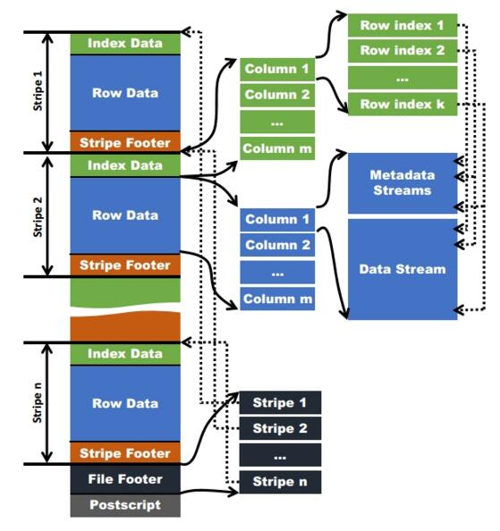
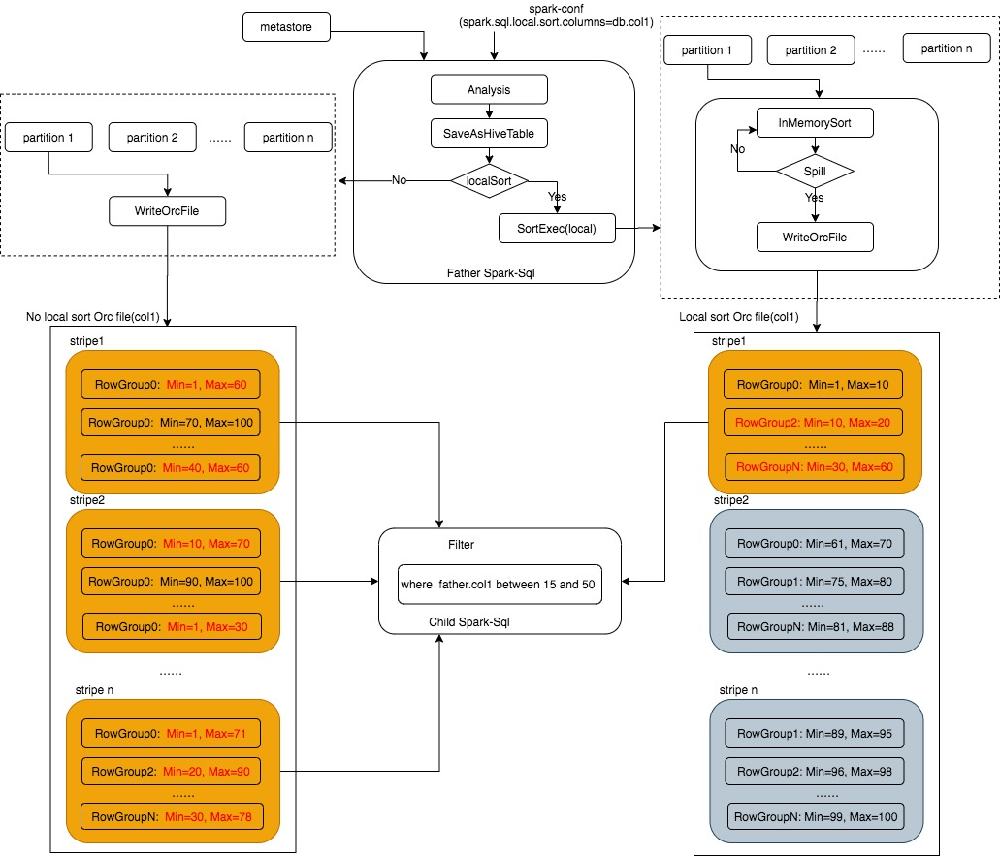

# LocalSort开发文档

## 需求

- Spark-sql任务在写表时,其写tasks会将其要处理数据依次写入各个文件，被写入的数据在各文件内部是无序状态；下游任务依赖该表，当按照某个高频字段进行查询时，会带来扫描信息较多，影响性能(具体原因详见：orc技术简述)。
- 通过LocalSort技术，对表文件(ORC)高频字段进行排序，使文件内部有序，当谓词下推到stripe、RowGroup级别时，结合orc索引技术，能够减少input数据量，提升检索效率。

## 应用场景

- 对于上游表具有高频字段，多个下游依赖该上游表，效率提升显著。

## 实现原理及方案

#### 1、orc 技术简述
  - ORC 文件格式

      
     - Postscripts中存储文件的行数，压缩参数，压缩大小，列等信息
     - FileFooter中包含该文件的统计结果，以及各个Stripe的位置信息
     - Stripe Footer中包含该stripe的统计结果，包括Max，Min，count等信息
     - IndexData中保存了该stripe上数据的位置信息，总行数等信息
     - RowData以stream的形式保存了数据的具体信息
  - ORC在每个文件中提供三级索引技术
     - 文件级别(一级索引) —— 有关整个文件中每列中值的统计信息；
     - stripe级别(二级索引) —— 有关每个条带的每列中值的统计信息；
     - 行组级别(rowGroup，三级索引) —— 条带中每组10,000行（默认值）的每列值的统计信息；

      注：1、一个文件里面包含多个stripes,一个stripe里面包含多个rowGroups；2、相关统计信息均存储在orc文件里(检索由1~3逐级过滤)。
  - 索引工作原理：
     - 假如查询过滤条件为WHERE id = 0;在Map Task读到一个ORC文件时，首先从文件的统计信息(一级索引)中查看id字段的min/max值，如果0不包含在内，那么跳过该文件；
     - 如果在这个文件中，那么继续查看每个stripe中id字段的min/max值（二级索引），如果0不包含在内，那么跳过该stripe；
     - 如果在该stripe中，则继续匹配rowGroup中的min/max值（三级索引），如果0不包含在内，那么跳过该rowGroup，否则的话读取。

#### 2、localSort技术原理
  - 对表ORC文件高频字段进行排序，使文件内部有序，当谓词下推到stripe、RowGroup级别时，能够减少input数据量，提升检索效率。

   备注说明：
   - local Sort是对文件级别进行排序；
   - spark-sql本身还有分桶(bucketing)的技术, 二者技术原理及实现目的虽然不一致，但在一定条件下二者效果等效，local-sort等价于bucketing：一个桶+sort列(
   当用户使用分桶技术时，说明其想对特定列排序已经提前设定，故与locaSort不能一起使用)。

   相关技术参考：
   - https://www.waitingforcode.com/apache-spark-sql/buckets-apache-spark-sql/read
   - https://jaceklaskowski.gitbooks.io/mastering-spark-sql/spark-sql-bucketing.html

#### 3、localSort设计

- 新增的配置参数

```
--conf spark.sql.local.sort.columns=<db1>.<tb1>:<col2>;<db2>.<tb3>:<col1,col2>;...
```

- localSort设计



## 数据膨胀问题定位

 - https://git.jd.com/bag/spark/wikis/local-sort%E8%86%A8%E8%83%80%E6%8E%92%E6%9F%A5

## localSort功能验证工具

 - https://git.jd.com/bag/orc-analyze-tool

## 测试与上线验证

#### 1. tpcds对数

#### 2. local sort benchmark

 - https://git.jd.com/bag/spark/issues/97

#### 3. 线上测试情况
 - https://git.jd.com/bag/spark/issues/96

## 代码链接

- https://git.jd.com/bag/spark/merge_requests/237

## issue链接

无

## 参考资料

- https://orc.apache.org/specification/ORCv1/
- https://mp.weixin.qq.com/s/JLB0dIQLHEL6CK_hOwYdAQ
- https://github.com/apache/orc.git


