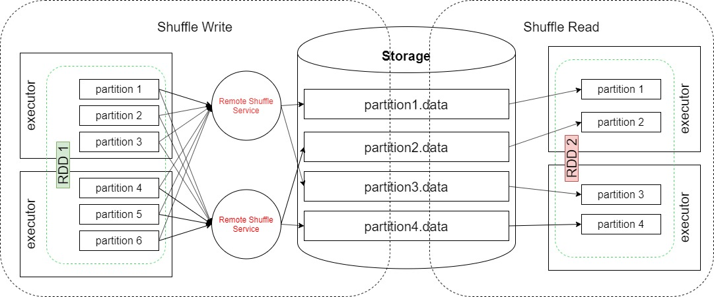
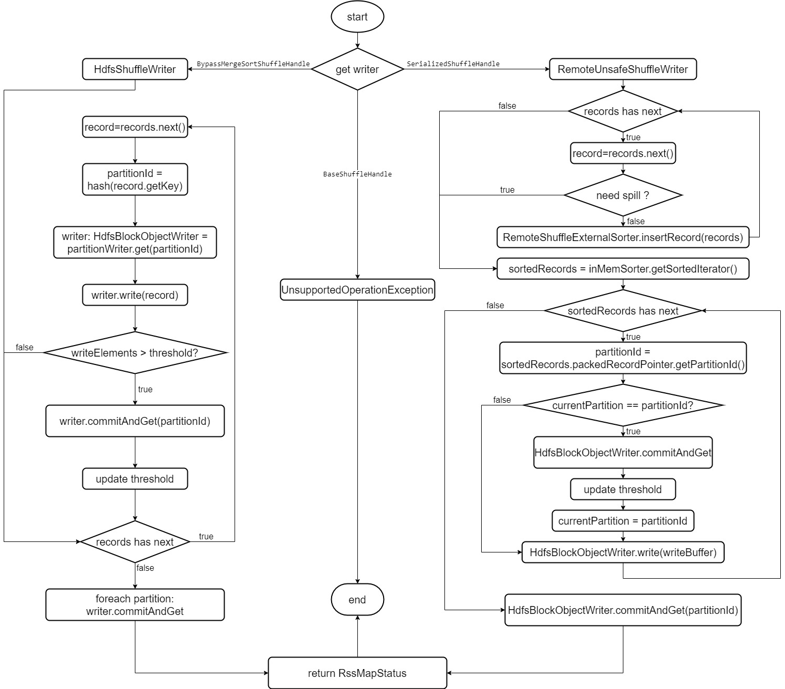
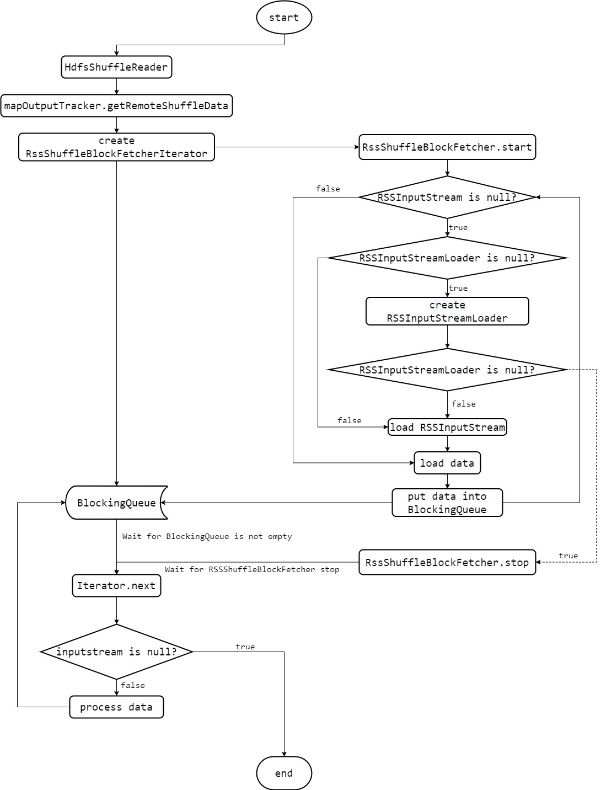

# RSS 整体架构

## Shuffle Write 阶段

Shuffle Write 的过程主要由两个入口进入，一个是 *HdfsShuffleWrite*，另外一个是 *RemoteUnsafeShuffleWriter*。整个 Shuffle Write 的流程图如下：

### HdfsShuffleWriter

- *HdfsShuffleWriter* 是由 *RemoteShuffleManager* 基于 *BypassMergeSortShuffleHandle* 而选择的 Shuffle Writer。
- 它首先为所有 partition 都创建一个 *HdfsBlockObjectWriter*。之后对所有的 record 进行处理。
- 每个 record 首先获取 key 并基于 hash 得到 key 对应的 partition id，以及对应的 *HdfsBlockObjectWriter*。
- 之后利用获取到的 *HdfsBlockObjectWriter* 将 record 写入内存缓冲区。
- 此时，如果写入到内存缓冲区的 record 数目 *recordsWritten* 大于可变阈值 *updatedElementsThreshold*，则将 *HdfsBlockObjectWriter* 内存缓冲区中的数据 **commitAndGet** 到远端的 *RSS* 中，并获取到此次写的数据大小 *bytesWritten*。
- 利用 *bytesWritten* 和 *recordsWritten* 对 *updatedElementsThreshold* 进行更新。
- 当所有 record 被处理完之后，需要对所有的 *HdfsBlockObjectWriter* 进行 **commitAndGet** 操作。
- 之后将写信息封装到 *RssMapStatus* 中返回给 *Driver*

### RemoteUnsafeShuffleWriter

- RemoteUnsafeShuffleWriter 是 *RemoteShuffleManager* 基于 *SerializedShuffleHandle* 而选择的 Shuffle Writer。
- 它首先将所有 record 一条条的插入到 *RemoteUnsafeExternalSorter* 中。在插入的过程中，在每一个 record 插入到 *RemoteUnsafeExternalSorter* 前，需要判断当前内存是否充足；如果不充足，需要进行 spill 操作。
  - spill 操作大体逻辑即为 `writeSortedFile(false)`
- 当所有 record 被插入完毕，需要进行 `writeSortedFile(true)`
- *writeSortedFile* 实际上对于传入的值 *isLastFile* 不会做任何特殊的处理，这个值只是为了与 *ShuffleExternalSorter* 进行适配并且勇于标识当前写是不是 spill 写仅此而已：
  - *writeSortedFile* 首先获取当前内存中写入的数据。
  - 之后，通过 *ShuffleSorterIterator* 获取当前数据所属的 *partitionId*。
  - 如果 *currentPartition* 与 *partitionId* 不一致，且 *currentPartition* 不是初始化值 -1，那么代表上一个 partition 已经全部写入到内存缓冲区了，需要进行一次 **commitAndGet** 操作。之后，更新 *updatedElementsThreshold* 的值。
  - 如果一致，则写入 record 数据。并检测当前写入的 record 个数是否达到 *updatedElementsThreshold* 的值。如果达到则进行 **commitAndGet** 操作，并更新 *updatedElementsThreshold* 的值。
- 最后，将 Shuffle Write 写的信息封装到 *RssMapStatus* 中返回给 Driver。

## Shuffle Read 阶段

Shuffle Read 整体流程如下：

Shuffle Read的入口只有一个，即 *HdfsShuffleReader*，它的流程如下：

- 首先通过 *MapOutputTracker* 从 *Driver* 上获取前一阶段 *Shuffle Write* 的信息 *RemoteShuffleReduceData*
- 创建 *RSSShuffleBlockFetcherIterator* 并启动线程 *RSSShuffleBlockFetcher*。
  - *RSSShuffleBlockFetcher* 首先检测 *RSSInputStream* 是否为空是否合法。
  - 如果 *RSSInputStream* 为空，则判断 *RSSInputStreamLoader* 是否为空，如果为空，则加载新的 *RSSInputStreamLoader*；否则利用 *RSSInputStreamLoader* 加载 *RSSInputStream*
  - 如果 *RSSInputStream* 不为空，则利用其加载数据。并将加载的数据添加进 *BlockingQueue* 中。
  - 如果新加载的 *RSSInputStreamLoader* 也为空，则结束 *RSSShuffleBlockFetcher* 线程。
  - **Notes**: *RSSInputStreamLoader* 对应的是整个 *partition group* 目录，而 *RSSInputStream* 对应的是目录下的每个文件。
- 如果 *BlockingQueue* 此时无数据，则等待。
- 当 *BlockingQueue* 中有数据时，读取数据。
- 当 BlockingQueue 中无法读出数据，且 *RSSShuffleBlockFetcher* 线程已经停止，则能够读取到一个 null *InputStream* 的数据，此时整个流程结束。