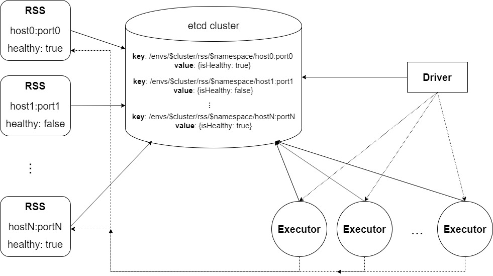

# RSS 服务发现开发文档

## 需求

- 目前的 RSS 是直接通过用户配置参数 `spark.shuffle.rss.hosts` 来获取到可用的 RSS 实例地址，并且通过 ping 获取来的地址以此来检测健康状态。这样做不仅不够准确，而且通过配置参数获取可用实例地址容易出错。同时，使用参数直接配置可用的 RSS 实例，在 RSS 上云的过程中，每当 RSS 进行维护重启，一旦 IP 和端口发生变化，则需要重新配置这一参数。
- 为了优雅的解决这一问题，我们需要加入 RSS 服务发现来解决这一问题。

## 应用场景

- 使用参数 `spark.shuffle.rss.etcd.hosts` 指定 etcd 集群信息，以此替代 `spark.shuffle.rss.hosts`：
  - 规避冗杂的 `spark.shuffle.rss.hosts` 配置。
  - 使用 ETCD 维护 RSS 健康信息以此获取准确的状态。

## 实现方案

根据 [issue 98](https://git.jd.com/bag/spark/issues/98) 所述，具体方案如下架构图所示：

### RSS 端

1. 首先 RSS 创建 etcd client 与 etcd cluster 进行交互。RSS 获取 etcd 的租约(Lease)，并设置 KeepAlive 和 TTL。
2. RSS 计算自己是否健康（目前的RSS是否健康定义为 `availableBytes > availablesThreshold && availableStreams > availableStreamsThreshold`），并写入到 etcd cluster 中。之后根据设置定时计算并更新自己的健康状态到 etcd cluster 中。
3. 当 RSS 正常退出时，汇报自己的健康状态为 *unhealthy*，并取消 KeepAlive 释放租约。
4. 当 RSS 异常退出（即无法汇报自己的健康状态）时，通过 TTL 在 etcd cluster 中删除对应的 key 和 value。

### Application

1. 当 Application 启动时，创建 Driver 时，首先需要判断是否启动 etcd 功能，如果启用，创建 etcd client，并访问 etcd 获取所有以 `/envs/$cluster/rss/$namespace/` 开头的 key 和 value。从所有 healthy 的 RSS 中随机选择 numServer 个RSS。不足则选择尽可能多。之后将这个RSS信息，设置为参数`spark.shuffle.rss.hosts` 的值。
2. 当 Executor 启动后，通过读取 `spark.shuffle.rss.hosts` 的值获取RSS实例信息，并根据实例信息创建 *HealthCheckedEndPoints* ，其中会定时访问 etcd 询问获取到的 RSS 实例健康状态。
3. 当 Executor 中的 task 运行时，需要用到 RSS 时，通过 *HealthCheckedEndPoints* 获取可用 RSS 实例，并向其中写入 shuffle 数据。

## 测试进度

- 已经进行过单元测试、回归测试、TPC-DS测试。
- 后向兼容性测试已经通过测试。

## 测试与上线

- 跟随下一次版本更新上线。

## 代码链接 

https://git.jd.com/bag/spark/merge_requests/243

## issue链接

- issue 98： https://git.jd.com/bag/spark/issues/98

## 参考资料

无