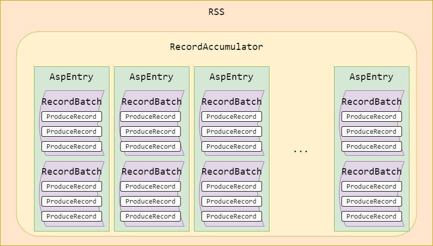
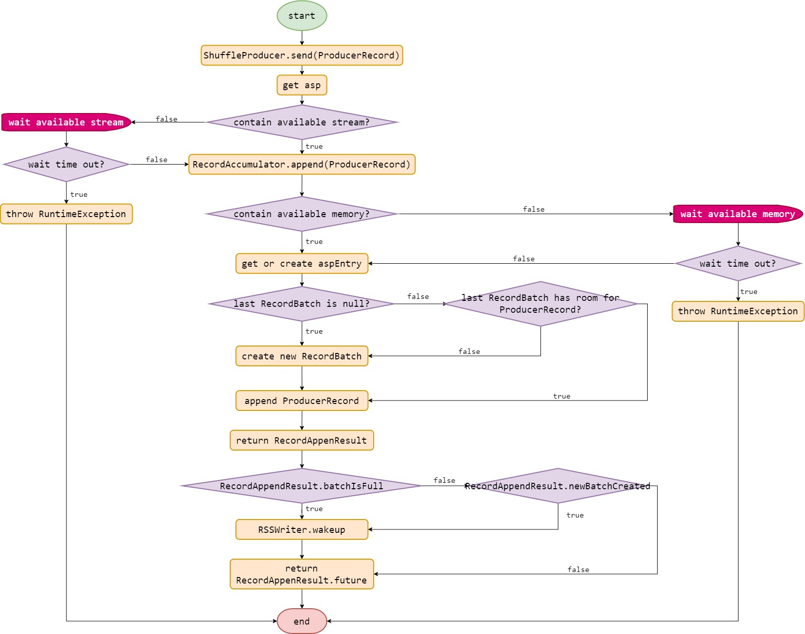
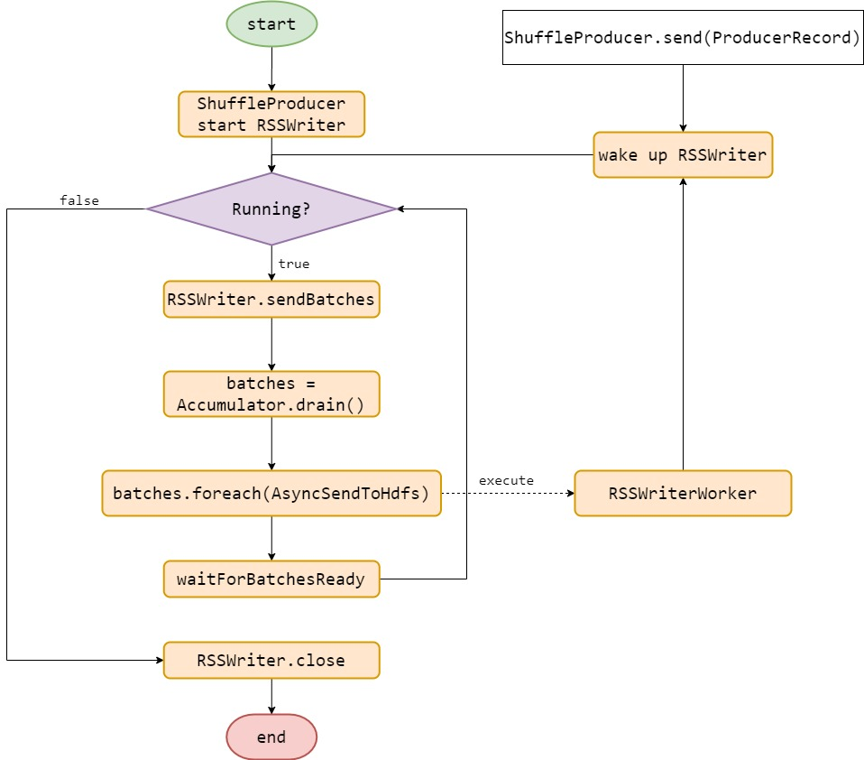

# RSS

## RSS 内存结构

RSS 的内存结构如上图所示，它的内存基本由 *RecordAccumulator* 进行管理。其中包含着一个 *Map*，用于存储 *Asp* (*AppId*, *ShuffleId*, *PartitionGroupId*) 与 *AspEntry* 之间的对应关系。

每个 *AspEntry* 中可以包含多个 *RecordBatch*，但通常数目不会很多。*RecordBatch* 是用于存储 *ProduceRecord* 的，当 *RecordBatch* 没有足够的空间存下新的 *ProduceRecord* 时，会创建新的 *RecordBatch*。

*RecordBatch* 是 RSS 最小的发送单位。即，每次写到 HDFS 的数据大小，是由 *RecordBatch* 的大小进行控制的。

## RSS 插入 ProducerRecord 的过程

插入 *ProducerRecord* 的流程如上图所示：

- 调用 `ShuffleProducer.send(ProducerRecord)` 函数开始插入 *ProducerRecord*。
- 获取 *ProducerRecord* 对应的 *Asp* 信息。
- 在插入前需要进行判断，当前 RSS 状态是否有可用的 *stream*。可用的 *stream* 可以是：
  - 在 *maxActiveStreams* 限制下新创建的
  - 相同的 *Asp* 已经创建过的
- 如果没有有可用的 *stream*，则等待创建新的 *stream*。如果一段时间内没有等待到可用的 *stream*，则会抛出 *RuntimeException*。
- 如果有可用的 stream，则让 *RecordAccumulator* 接管 *ProducerRecord*。
- 在 *RecordAccumulator* 接管 *ProducerRecord* 之后，同样需要判断是否有可用的内存进行分配。如果没有，则需要等待可用的内存。如果一段时间内没有等待到可用的内存，那么会抛出 *RuntimeException*。
- 当拥有可用的内存时，*RecordAccumulator* 首先根据 *Asp* 获取对应的 *AspEntry*，如果不存在则创建。并且保证一个 *Asp* 只会有一个 *AspEntry*。
- *AspEntry* 中包含一个 *deque*，从 *deque* 中取出最后一个 *RecordBatch*。如果此时不存在 *RecordBatch*，则需要创建新的 *RecordBatch*；如果存在，则需要判断这个 *RecordBatch* 中是否拥有充足的空间存放 *ProducerRecord*。如果没有足够的空间存放 *ProducerRecord*，那么需要创建一个新的 *RecordBatch*。
- 在 *RecordBatch* 中存放 *ProducerRecord*，并返回 *RecordAppendResult* 信息回到 *ShuffleProducer*。
- 从 *RecordAppendResult* 中获取信息：如果 *RecordBatch* 满了或者有新的 *RecordBatch* 被创建，则唤醒 *RSSWriter* 线程。
- 之后返回 *RecordAppendResult* 中的 *future*。尽管这个 *future* 目前在 RSS 中已经没有什么作用了。

## RSS 写过程

RSS 写的流程如上图所示：

- 启动 *ShuffleProducer* 的时候，由 *ShuffleProducer* 启动 *RSSWriter* 线程。
- *RSSWriter* 线程循环的执行 **sendBatches**。
- **sendBatches** 会从 *RecordAccumulator* 中对所有的 *AspEntry* 执行 **drain** 方法以获取 *readyRecordBatch*，其中 *readyRecordBatch* 包括：
  - 设置 *forceDrain* 的；
  - *RecordBatch* 已经满了的；
  - *RecordBatch* 在 *RecordAccumulator* 中等待时间超过 *lingerMs* 的；
  - *RecordBatch* 中所有 *ProducerRecord* 发送客户端的 *pressure* 超过 *CLIENT_PRESSURE_THRESHOLD* 的；
  - 由于内存不足而必须发送一些 *RecordBatch* 的。
- 获取到需要发送的 *RecordBatch* 后，*RSSWriter* 为所有的 *ReadyRecordBatch* 创建一个线程 *RSSWriterWorker* 以执行写操作。
- 之后 *RSSWriter* 等待下一次被其它线程主动唤醒或者超时被唤醒。
- *RSSWriterWorker* 在写完之后，释放 *RecordBatch* 的内存空间，并且唤醒 *RSSWriter*。
- 在 *ShuffleProducer* 被关闭时，设置 *RSSWriter* 中的 *running* 为 *false* 并关闭 *RSSWriter*。